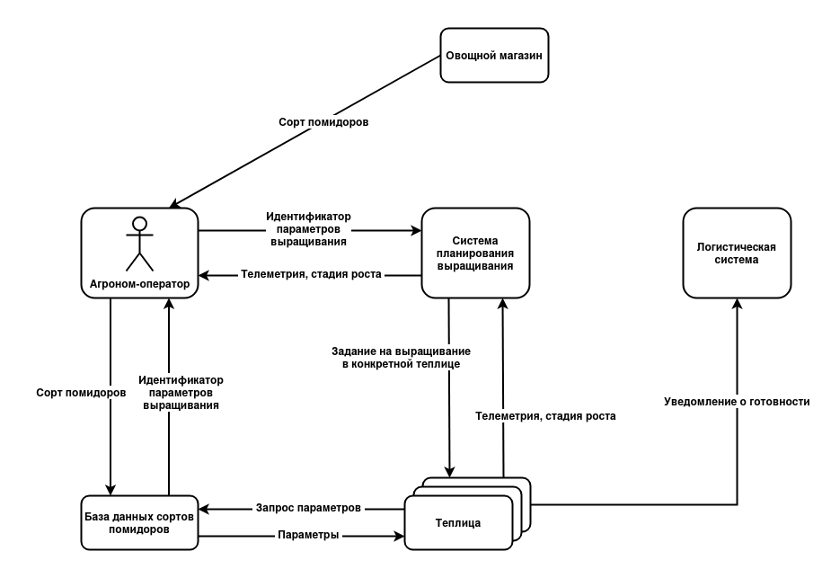
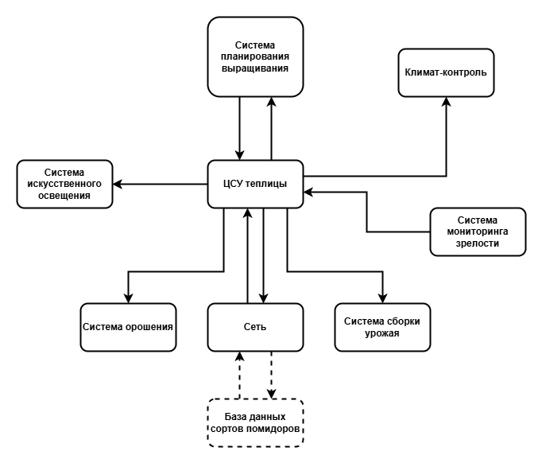
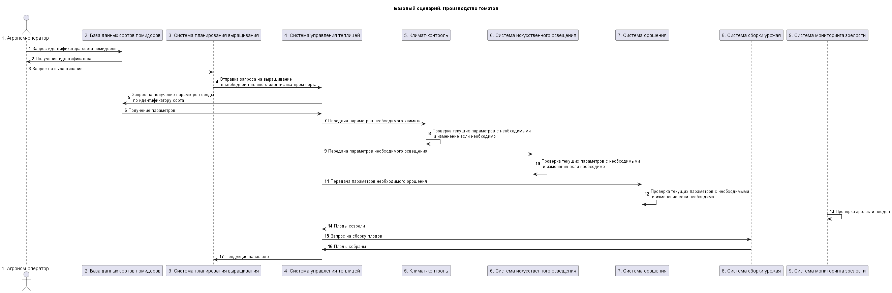
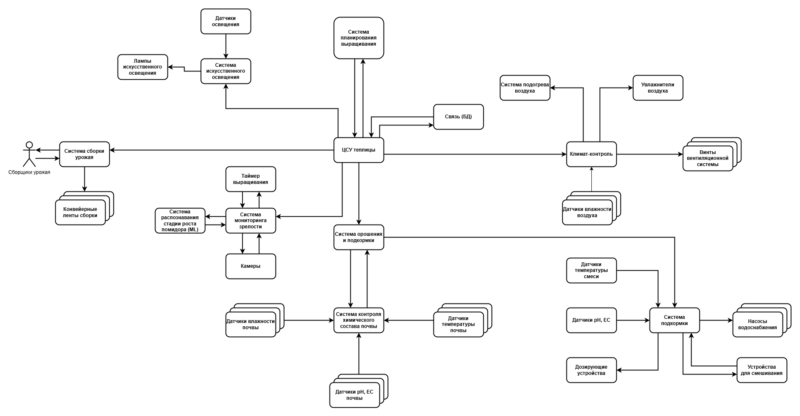

# Отчёт о выполнении задачи "Киберимунный сельскохозяйственный комплекс по выращиванию помидоров"
- [Отчёт о выполнении задачи "Киберимунный сельскохозяйственный комплекс по выращиванию помидоров"](#отчёт-о-выполнении-задачи-name)
  - [Постановка задачи](#постановка-задачи)
  - [Известные ограничения и вводные условия](#известные-ограничения-и-вводные-условия)
    - [Цели и Предположения Безопасности (ЦПБ)](#цели-и-предположения-безопасности-цпб)
  - [Архитектура системы](#архитектура-системы)
    - [Контекст работы системы](#контекст-работы-системы)
    - [Компоненты](#компоненты)
    - [Алгоритм работы решения](#алгоритм-работы-решения)
    - [Описание Сценариев (последовательности выполнения операций), при которых ЦБ нарушаются](#описание-сценариев-последовательности-выполнения-операций-при-которых-цб-нарушаются)
    - [Переработанная архитектура](#переработанная-архитектура)
    - [Указание "доверенных компонент" на архитектурной диаграмме.](#указание-доверенных-компонент-на-архитектурной-диаграмме)
    - [Проверка негативных сценариев](#проверка-негативных-сценариев)
    - [Политики безопасности](#политики-безопасности)
  - [Запуск приложения и тестов](#запуск-приложения-и-тестов)
    - [Запуск приложения](#запуск-приложения)
    - [Запуск тестов](#запуск-тестов)

## Постановка задачи
- Компания создает киберимунный агрокомплекс для автоматизированного выращивания томатов в условиях закрытого грунта. Комплекс должен функционировать с минимальным участием человека, обеспечивая полный цикл выращивания - от посадки семян до сбора урожая - за счет сенсорного контроля окружающей среды. 
- При этом агрокомплекс работает в среде с высокой биологической чувствительностью: малейшие отклонения в параметрах температуры, влажности, освещённости или состава питательной среды могут повлиять на урожай. Кроме того, система должна быть защищена от кибератак, так как внешнее вмешательство может привести к потере данных, изменению режимов работы или заражению растений вредителями через сбой в биозащите. 
- Поэтому требуется централизованная система управления с самодиагностикой, автоматическое отслеживание критических параметров среды и механизм быстрого реагирования на возникающие отклонения

Ценности, ущербы и неприемлемые события

|Ценность|Негативное событие|Оценка ущерба|Комментарий|  
|:-:|:-:|:-:|:-:|
|Люди|Автоматизированная техника травмировала сотрудника|Высокий|Ответственность компании, судебные разбирательства|
|Растения|Вредоносное вмешательство привело к уничтожению урожая|Высокий|Потери продукции, финансовые убытки|  
|Окружающая среда|Сбой в системе контроля привёл к выбросу вредных веществ|Высокий|Экологические последствия, штрафы|  
|Данные агрокомплекса|Нарушение целостности данных привело к неверным решениям по уходу|Средний|Снижение урожайности, дополнительные затраты|  
|Данные агрокомплекса|Утечка данных о параметрах системы|Высокий|Конкурентные риски, возможность кибератак|
|Автоматизированные системы|Поломка или саботаж оборудования|Средний|Остановка процессов, финансовые потери|  
|Инфраструктура|Сбой в системе привёл к аварии (пожар, затопление и т. д.)|Высокий|Разрушение имущества, угроза жизни сотрудников|

## Известные ограничения и вводные условия
- Используется микросервисная архитектура и брокер сообщений для реализации асинхронной работы сервисов.
- Между собой сервисы общаются через брокер сообщений, а все внешнее взаимодействие происходит через REST API.
- Графический интерфейс для взаимодействия с пользователем не требуется, достаточно примеров REST запросов.

### Цели и Предположения Безопасности (ЦПБ)
Цели безопасности:
2. Выполняются только аутентичные задания на выращивание.
3. Нарушение процесса выращивания не должно приводить к заражению почвы.
4. Параметры климата, полива и освещения остаются в безопасных пределах.
5. Персонал сборщиков урожая не должен получать травмы из-за сбоя систем.

Предположения безопасности:
1. Только авторизованные сотрудники управляют системами.
2. База параметров выращивания не содержит опасные параметры окружающей среды.
3. Все поставщики расходных материалов(семена/удобрения/почва/пестицицы и т.п.) благонадежны, что исключает возможность изначальной порчи или заражения расходных материалов.
4. Оборудование защищено от повреждения из-за неправильного управления.
5. Монитор безопасности и брокер сообщений доверенные модули.
6. Опыление растений происходит естественным путем, реализация искусственного опыления не требуется.

## Архитектура системы
### Контекст работы системы
- Агроном-оператор и теплицы взаимодействуют с базой данных параметров, необходимых для выращивания, помимо системы системы планирования выращивания.
- Система планирования выращивания знает какие теплицы на момент получения задания свободны и инициализирует процесс для конкретной теплицы с использованием идентификатором параметров выращивания.
- Система управления теплицей получает по идентификатору параметров выращивания уровень освещения, концентрацию удобрений, влажность почвы и др.
- Для сбора урожая используется персонал сборщиков и конвейерные ленты.

### Общая архитектура системы

### Высокоуровненая архитектура теплицы

### Базовый сценарий

### Депомпозированная архитектура теплицы
