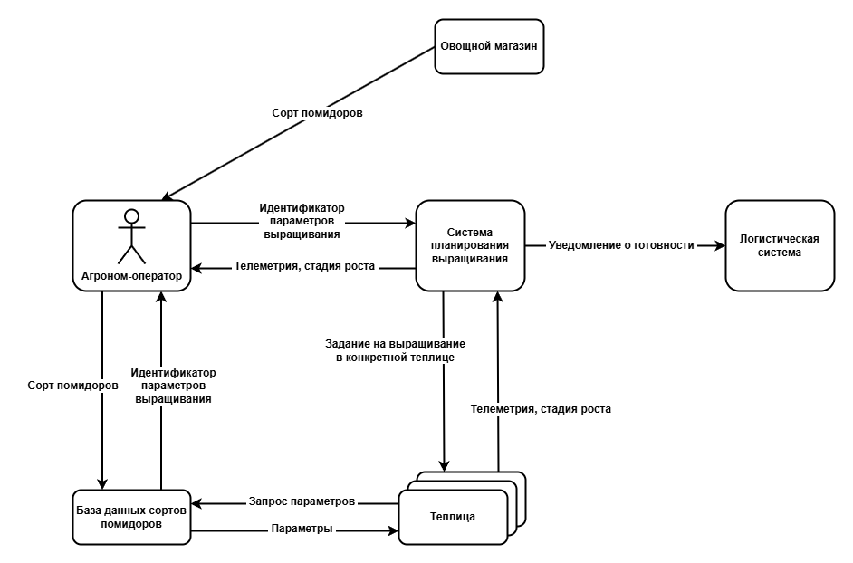
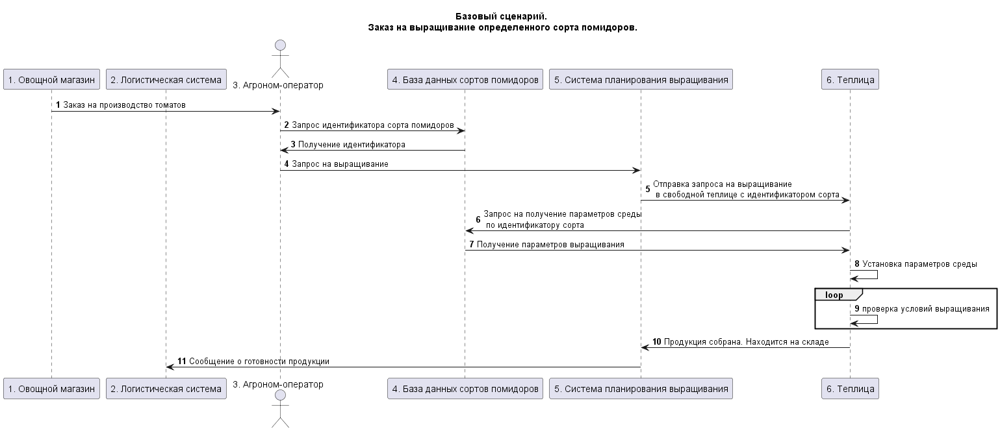
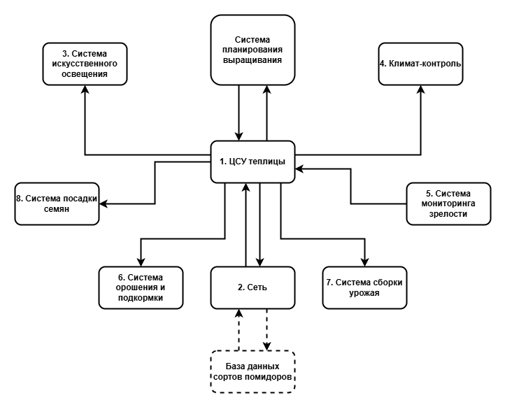
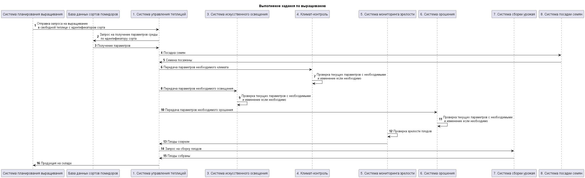
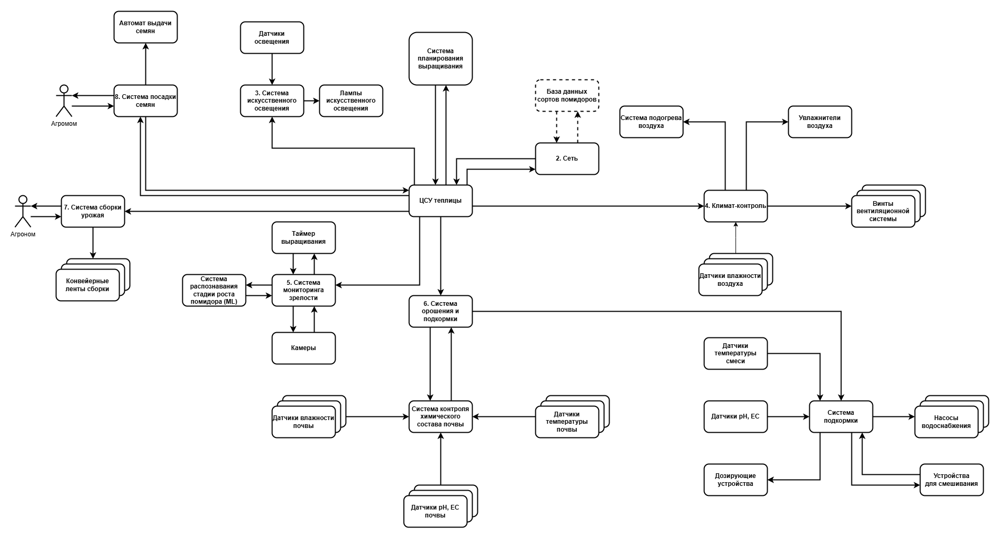

# Отчёт о выполнении задачи "Киберимунный сельскохозяйственный комплекс по выращиванию помидоров"
- [Отчёт о выполнении задачи "Киберимунный сельскохозяйственный комплекс по выращиванию помидоров"](#отчёт-о-выполнении-задачи-name)
  - [Постановка задачи](#постановка-задачи)
    - [Ценности, ущербы и неприемлемые события](#ценности-ущербы-и-неприемлемые-события)
  - [Известные ограничения и вводные условия](#известные-ограничения-и-вводные-условия)
    - [Цели и Предположения Безопасности (ЦПБ)](#цели-и-предположения-безопасности-цпб)
  - [Архитектура системы](#архитектура-системы)
    - [Контекст работы системы](#контекст-работы-системы)
    - [Компоненты](#компоненты)
    - [Общая архитектура системы](#общая-архитектура-системы)
    - [Базовый сценарий](#базовый-сценарий)
    - [Декомпозированная архитектура теплицы](#декомпозированная-архитектура-теплицы)

## Постановка задачи
- Компания создает киберимунный агрокомплекс для автоматизированного выращивания томатов в условиях закрытого грунта. Комплекс должен функционировать с минимальным участием человека, обеспечивая полный цикл выращивания - от посадки семян до сбора урожая - за счет сенсорного контроля окружающей среды. 
- При этом агрокомплекс работает в среде с высокой биологической чувствительностью: малейшие отклонения в параметрах температуры, влажности, освещённости или состава питательной среды могут повлиять на урожай. Кроме того, система должна быть защищена от кибератак, так как внешнее вмешательство может привести к потере данных, изменению режимов работы или заражению растений вредителями через сбой в биозащите. 
- Поэтому требуется централизованная система управления с самодиагностикой, автоматическое отслеживание критических параметров среды и механизм быстрого реагирования на возникающие отклонения

### Ценности, ущербы и неприемлемые события

|Ценность|Негативное событие|Оценка ущерба|Комментарий|  
|:-:|:-:|:-:|:-:|
|Люди|Автоматизированная техника травмировала сотрудника|Высокий|Ответственность компании, судебные разбирательства|
|Растения|Вредоносное вмешательство привело к уничтожению урожая|Высокий|Потери продукции, финансовые убытки|  
|Окружающая среда|Сбой в системе контроля привёл к выбросу вредных веществ|Высокий|Экологические последствия, штрафы|  
|Данные агрокомплекса|Нарушение целостности данных привело к неверным решениям по уходу|Средний|Снижение урожайности, дополнительные затраты|  
|Данные агрокомплекса|Утечка данных о параметрах системы|Высокий|Конкурентные риски, возможность кибератак|
|Автоматизированные системы|Поломка или саботаж оборудования|Средний|Остановка процессов, финансовые потери|  
|Инфраструктура|Сбой в системе привёл к аварии (пожар, затопление и т. д.)|Высокий|Разрушение имущества, угроза жизни сотрудников|

## Известные ограничения и вводные условия
- Используется микросервисная архитектура и брокер сообщений для реализации асинхронной работы сервисов.
- Между собой сервисы общаются через брокер сообщений, а все внешнее взаимодействие происходит через REST API.
- Графический интерфейс для взаимодействия с пользователем не требуется, достаточно примеров REST запросов.

### Цели и Предположения Безопасности (ЦПБ)
Цели безопасности:
1. Выполняются только аутентичные задания на выращивание.
2. Нарушение процесса выращивания не должно приводить к заражению почвы.
3. Параметры климата, полива и освещения остаются в безопасных пределах.
4. Персонал сборщиков урожая не должен получать травмы из-за сбоя систем.

Предположения безопасности:
1. Только авторизованные сотрудники управляют системами.
2. База параметров выращивания не содержит опасные параметры окружающей среды.
3. Все поставщики расходных материалов(семена/удобрения/почва/пестицицы и т.п.) благонадежны, что исключает возможность изначальной порчи или заражения расходных материалов.
4. Оборудование защищено от повреждения из-за неправильного управления.
5. Монитор безопасности и брокер сообщений доверенные модули.
6. Опыление растений происходит естественным путем, реализация искусственного опыления не требуется.

## Архитектура системы
### Контекст работы системы
- Агроном-оператор и теплицы взаимодействуют с базой данных параметров, необходимых для выращивания, помимо системы системы планирования выращивания.
- Система планирования выращивания знает какие теплицы на момент получения задания свободны и инициализирует процесс для конкретной теплицы с использованием идентификатором параметров выращивания.
- Система управления теплицей получает по идентификатору параметров выращивания уровень освещения, концентрацию удобрений, влажность почвы и др.
- Для сбора урожая используется персонал сборщиков и конвейерные ленты.

### Общая архитектура системы

Базовый сценарий работы

### Архитектура теплицы

Базовый сценарий выращивания

|Компонент|Назначение|
|:--|:--|
|1. Центральная система управления теплицы (ЦСУ теплицы)| Осуществляет общее управление теплицей, отправляет команды управления остальным модулям |
|2. Сеть | Отвечает за взаимодействие с базой данных сортов помидоров, в которой находятся параметры среды для выращивания |
|3. Система искусственного освещения| Регулирует световой режим при выращивании|
|4. Климат-контроль| Регулирует параметры влажности и темпиратуры воздуха|
|5. Система мониторинга зрелости| анализирует данные с камер для оценки зрелости плода, а также учитывает необходимый временной отрезок времени для выращивания|
|6. Система орошения| Отвечает за концентрацию удобрений и надлежащий уровень влажности почвы |
|7. Система сборки урожая| Полуавтоматическая система сборики урожая с ипользованием конвейерной ленты |
|8. Система посадки семян| Система посадки семян с помощью агрономов и автоматической выдачей семян |

## Описание Сценариев (последовательности выполнения операций), при которых ЦБ нарушаются
Напоминание ЦБ:
1. Выполняются только аутентичные задания на выращивание.
2. Нарушение процесса выращивания не должно приводить к заражению почвы.
3. Параметры климата, полива и освещения остаются в безопасных пределах.
4. Персонал сборщиков урожая не должен получать травмы из-за сбоя систем.

|Атакованный компонент|ЦБ1|ЦБ2|ЦБ3|ЦБ4|Кол-во нарушений|
|:--|:-:|:-:|:-:|:-:|:-:|
|1. ЦСУ теплицы|🔴|🔴|🔴|🔴|4/4|
|2. Сеть|🔴|🔴|🔴|🔴|4/4|
|3. Система искусственного освещения|🟢|🟢|🔴|🟢|1/4|
|4. Климат-контроль|🟢|🟢|🔴|🟢|1/4|
|5. Система мониторинга зрелости|🟢|🟢|🟢|🟢|0/4|
|6. Система орошения|🟢|🔴|🔴|🟢|2/4|
|7. Система сборки урожая|🟢|🟢|🟢|🔴|1/4|
|8. Система посадки семян|🔴|🟢|🟢|🟢|1/4|

🟢 - ЦБ не нарушена 🔴 - ЦБ нарушена

### Негативыне сценарии
|Название сценария|Описание|
|---|----------------------|
|НС-1| Модуль **центральной системы управления теплицей** получил идентификатор задания на выращивание сорта помидоров, но полученые из базы данных параметры окружающей среды были изменены на **опасные**, что привело к нарушению ЦБ 1, 2, 3, 4 |
|НС-2| Модуль **сети** получил получил данные о параметра окружающей среды для выращивания сорта помидоров, но полученые из базы данных параметры окружающей среды были изменены на **опасные**, что привело к нарушению ЦБ 1, 2, 3, 4 |
|НС-3|Модуль **системы искусственного освещения** получил необходимые параметры освещения, но лампы искусственного освещения были включены на полную мощность, что привело к нарушению ЦБ 3 |
|НС-4|Модуль **климат-контроля** получил необходимые параметры влажности и темпиратуры воздуха, но обогреватели раскалили воздух, что привело к нарушению ЦБ 3 |
|НС-5|Модуль **системы орошения** получил необходимые параметры полива и удобрения, но были изменены парметры смешивания химических элементов, что привело к нарушению ЦБ 2, 3 |
|НС-6|Модуль **системы сборки урожая** получил команду о сборки урожая до его фактического созревания, а также во время химеческой обработки растений, что привело к нарушению ЦБ 4 |
|НС-7|Модуль **системы посадки семян** получил команду о выдаче семян, но были выданы семена другого сорта томатов, что привело к нарушению ЦБ 1 |

### Декомпозированная архитектура теплицы
